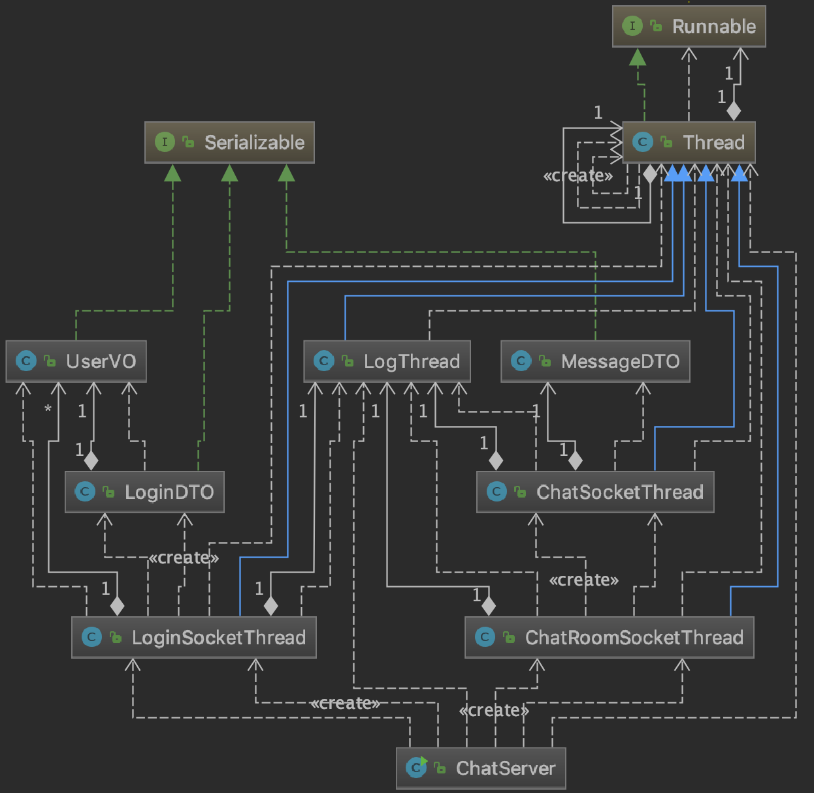

Java Chatting Application
===

<a href="https://1ilsang.blog.me/"></a>
<a href="#"></a>
<a href="#"></a>
<a href="#"></a>

멀티 채팅 토이 프로젝트.

- 핵심 목표: 스프링 공부 전에 다형성, MVC, 쓰레드, 소켓을 짚어보자.
- 제작 기간: 약 10일
- Keyword: MVC, Thread, Socket, GCP, Polymorphism, Serializable, AWT, Singleton

더 나은 코드를 위해 많은 코멘트 부탁드립니다!

> Readme 작성중...

<br/>

샘플 화면
---
AWT로 개발되었기 때문에 윈도우에서는 참혹한 뷰를 보셔야 합니다(...)

| Login View | Chat View |
|:----------------------------------------:|:-----------------------------------------:|
|||

- Server Log


<br/>

개발 과정
---
Commit 로그에 코드와 함께 자세하게 찍혀있습니다.


1. 1:1 로컬 채팅 완성
2. 1:N 로컬 채팅 완성
3. MVC 분리
4. 로그인 처리
5. 클라우드(GCP) 환경 배포
6. README

<br/>

한눈에 보는 전체 구성
---


<hr/>


- Client: 
  - 모든 요청은 `DispatcherController`를 거치며 `HandlerMapping` 객체가 해당 비지니스의 적절한 `Controller`를 찾아 메서드를 실행한다.
  - 각 `Controller`는 실제 비지니스 수행을 위해 자신의 `Service`에 요청 객체를 넘긴다.
  - `Service`에서 서버와 통신하는 Login, Chatting 소켓이 열린다. 통신은 모두 `직렬화`된 객체를 사용한다.
  - Chatting 소켓은 연결마다 `ChatAcceptThread` 쓰레드 객체로 파생해 진행한다.
  - 각각의 요청은 `ModelAndView` 객체에 담겨 레이어층(컨트롤러/뷰/서비스 등)을 거친다.
  - Service 를 통해 처리된 데이터는 `return` 되어 `DispatcherController`에게 전달되며 이때 `ViewResolver`가 유저에게 보여줄 화면객체를 찾는다.
  - 보여줄 화면객체를 찾았다면  `View` 객체를 통해 유저에게 화면을 보여준다.
  - 모든 컨트롤러와 서비스, 뷰는 싱글톤으로 구성되어 있다.

- [Read more!](markdown/index/Client.md)

<br/>
<br/>



- Server:
  - 서버는 실행과 동시에 `LogThread`, `LoginSocketThread`, `ChatRoomSocketThread` 3가지 쓰레드를 파생시킨다.
  - `LogThread`는 서버에 들어오는 모든 요청/메시지 등을 로그에 기록 및 텍스트 파일에 저장한다.
  - 모든 로그는 resources/chatLog.txt 에 자동 저장된다.
  - 이때 저장 순서를 지켜주기 위해 `queue`에 담아 순차적으로 저장한다.
  - `LoginSocketThread`는 로그인 처리를 하는 *단일* 쓰레드로, DB를 사용하지 않으므로 **Map 자료구조**를 사용해 "이름":"유저객체"로 저장한다.
  - 그러므로 서버가 재시작되면 유저정보는 사라진다.
  - `ChatRoomSocketThread`는 클라이언트의 요청소켓을 받아 각 소켓마다 `ChatSocketThread`를 파생시킨다.
  - `ChatSocketThread` 객체는 클라이언트의 소켓을 분석해 채팅방별로 관리해 적절하게 메시지를 뿌려준다.

- [Read more!](markdown/index/Server.md)
<br/>

어떻게 실행하나요?
---
- 로컬 환경에서 실행하기
  - client 폴더과 server 폴더를 각각 *root*로 잡아 ChatTest, ChatServer 클래스에서 main 실행.
  - *중요* `server/resources/` 폴더에 있는 `chatLog.dat` 파일을 `chatLog.txt`로 변경해주셔야 합니다.
  - 로컬환경이므로 `REMOTE_HOST`가 `127.0.0.1`인지 꼭 확인.

- [클라우드 환경(GCP)으로 서비스 해보기](markdown/index/Gcp.md)
  - GCP Console 로 들어간다.
  - VM 인스턴스를 생성한다.
  - Server 를 jar 파일로 만든다.
  - ssh 키를 만든다.
  - gcp 에 추가해준다.
  - scp 를 통해 VM에 jar 파일을 보낸다.
  - 채팅포트 `7777`과 로그인포트 `6666`을 열어준다.
  - 서버실행. ```java -jar 파일명.jar```
  - Client 를 jar 파일로 만든다.(REMOTE_HOST 설정)
  - client jar 파일을 배포한다.(더 해보기: exe 파일로 변환)
  - 재밌게 채팅한다!

클래스 단위로 알아보기
---
- [Client](markdown/index/Client.md)
  - Main
  - Controller
  - DTO
  - Domain
  - View
  - Service
  - Thread
  - Util
  
- [Server](markdown/index/Server.md)
  - Main
  - Thread
  - DTO/Domain 은 client 와 동일.
  
맺으며
---
- 코딩도 어렵지만 문서화가 더 어려웠다.
- 초반 설계가 정말 어려웠다. 관점 분리가 특히 어려웠다.
- TODOLIST
  - [ ] MSA 환경으로 업그레이드
  - [ ] 중복 로그인 방지
  - [ ] 파일 log 배치처리 및 자동화
  - [ ] 채팅방 동적 생성
  - [ ] 모든 상수 필드 외부파일로 빼거나 클래스화
  - [ ] 채팅방 입장시 태그가 잠깐 보이는 문제 해결
- 취업하고싶다.
- [Come to my Blog!](https://1ilsang.blog.me)

License
---
This is released under the MIT license. See [LICENSE](LICENSE) for details.
