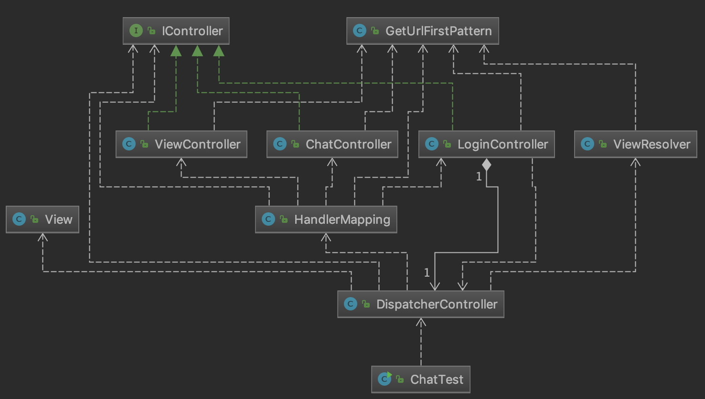

Client 클래스 분석
---


Main
---
```
public class ChatTest {
    public static void main(String[] args) {
        DispatcherController dispatcherController = DispatcherController.getInstance();
        ModelAndView modelAndView = new ModelAndView("/view/index");
        dispatcherController.in(modelAndView);
    }
}
```
- 싱글톤으로 만들어진 디스패처 컨트롤의 인스턴스를 가져온다.
- 모든 통신은 `ModelAndView`객체를 통해 이루어지므로 해당 객체를 만든다.
- 채팅 어플 실행과 동시에 index 화면을 불러올 것이므로 `/view/index` Path 를 지정한다.
- 컨트롤러에 지정된 M&V 객체를 던진다.

Controller
---
```
public interface IController {
    ModelAndView in(ModelAndView modelAndView);
}
```
- 모든 컨트롤러는 IContrller 인터페이스를 구현한다. 이유는 **다형성**을 위해서.



```
    public void in(ModelAndView modelAndView) {
        IController controller = HandlerMapping.getController(modelAndView);
        System.out.println("DispatcherController: " + controller);
        modelAndView = controller.in(modelAndView);

        IView view = ViewResolver.getView(modelAndView);
        if(view != null) View.showFrame(view, modelAndView);
    }
```
- 모든 컨트롤러는 비지니스 로직이 없어야 한다. 오직 분기처리만 하도록 설계했다.
- Main에서 호출된 `DispatcherController`는 `MandlerMapping`객체를 통해 `ModelAndView`의 값을 분석, `Controller`를 `return`한다.
- `return`된 `Controller`는 **다형성**으로 바로 실행된다. `controller.in()`
- 컨트롤러들이 `in` 동작을 마치고(Service 에서 리턴되었다면) 나면 `ViewResolver`를 통해 `View`를 찾는다.
- `View`가 리턴된다면 `showFrame` 함수를 통해 화면을 표시한다.
- 모든 `View` 객체 또한 `IView` 인터페이스를 구현하므로 `showFrame` 함수 하나로 다형성을 구현한다.

LoginController
---
```
public class LoginController implements IController{
    private DispatcherController dispatcherController;
    private LoginService loginService = LoginService.getInstance();
    public static LoginController getInstance() {
        return loginController;
    }
    private static LoginController loginController = new LoginController();
    private LoginController() {}

    @Override
    public ModelAndView in(ModelAndView modelAndView) {
        dispatcherController = DispatcherController.getInstance();

        String pattern = GetUrlFirstPattern.getStringPattern(modelAndView);
        System.out.println("LoginController: " + pattern);
        LoginDTO loginDTO = null;

        if(pattern.equals("/signIn")) {
            loginDTO = loginService.signIn(modelAndView);
        } else if(pattern.equals("/signUp")) {
            loginDTO = loginService.signUp(modelAndView);
        }

        String name = modelAndView.getUserName();
        modelAndView.clear();

        if(loginDTO.isAccess()) {
            dispatcherController.setUserName(name);
            modelAndView.setUserName(name);
            modelAndView.setUrl("/roomList");
        } else {
            modelAndView.setText(loginDTO.getMessage());
            modelAndView.setUrl(loginDTO.getUrl());
        }

        return modelAndView;
    }
}
```
- `ModelAndView`를 분석해 `Service`를 선택해 계속해서 객체를 넘긴다.
- `Service`는 서버와 통신을 하므로 그 결과를 `DTO` 객체에 담는다.
- `DTO` 객체의 값에따라 `ModelAndView` 객체를 수정해주고 `return` 해준다.
- `return` 되면 그 이후는 다시 `DispatcherController`가 관리한다.

Login Service
---
```
    ...
    public LoginDTO signUp(ModelAndView modelAndView) {
        modelAndView.setUrl("/register");
        return getPermission(modelAndView, "/signUp");
    }

    private LoginDTO getPermission(ModelAndView modelAndView, String action) {
        LoginDTO sendDTO = new LoginDTO();
        sendDTO.setMessage("서버가 연결되어 있지 않습니다!");
        sendDTO.setAccess(false);
        sendDTO.setUrl("/home");

        try {
            Socket socket = new Socket(REMOTE_HOST, Integer.parseInt(PORT));
            ObjectOutputStream out = new ObjectOutputStream(socket.getOutputStream());
            ObjectInputStream in = new ObjectInputStream(socket.getInputStream());

            UserVO userVO = new UserVO();
            userVO.setUserName(modelAndView.getUserName());
            userVO.setPw(modelAndView.getPw());

            sendDTO.setAction(action);
            sendDTO.setUserVO(userVO);

            out.writeObject(sendDTO);
            out.flush();

            LoginDTO getDTO = (LoginDTO) in.readObject();

            getDTO.setUrl(modelAndView.getUrl());
            System.out.println("Login " + action + ": " + getDTO.isAccess() + ", " + getDTO.getMessage());

            return getDTO;
        } catch (Exception e) {
            e.printStackTrace();
        }
        return sendDTO;
    }
```
- `Socekt` 을 열어 원격지 호스트와의 통로를 만든다.
- 객체를 교환하므로 ObjectIn(Out)putStream 을 열어준다.
- DTO 객체에 In/Out 값들을 담아 교환한다.
- 통신이 끝나면 마무리한다.
- `return` 을 통해 `LoginController`로 값을 던진다.
