GCP 로 채팅어플 배포하기
---
- 요약: jar 파일을 올리고 포트를 열어준다.

 

# 1. GCP Console 로 들어간다.
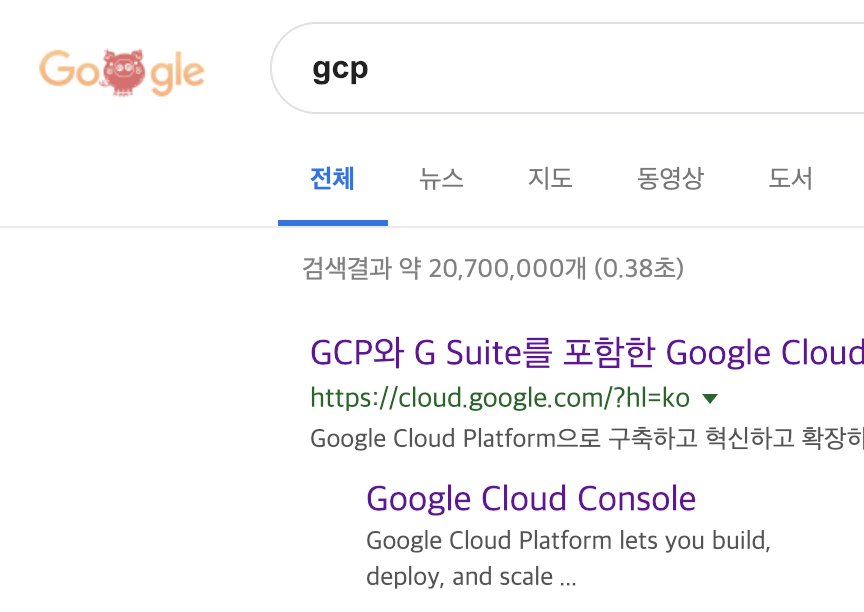

 
 

# 2. VM 인스턴스를 생성한다.
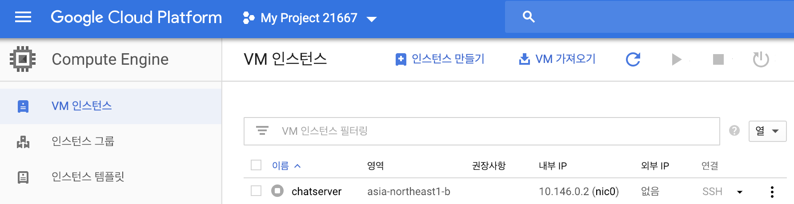

 
 

# 3. Server 를 jar 파일로 만든다.
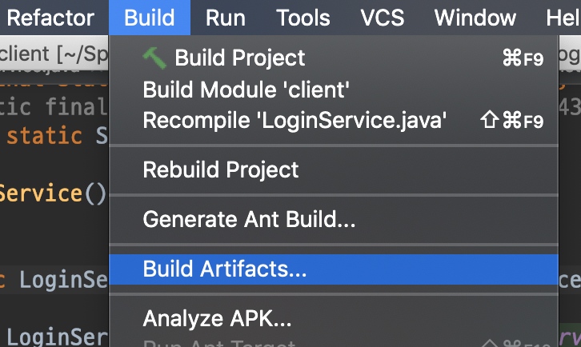
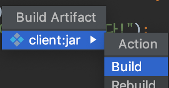
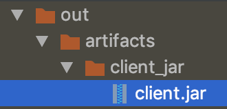

 
 

# 4. ssh key 를 만든다.
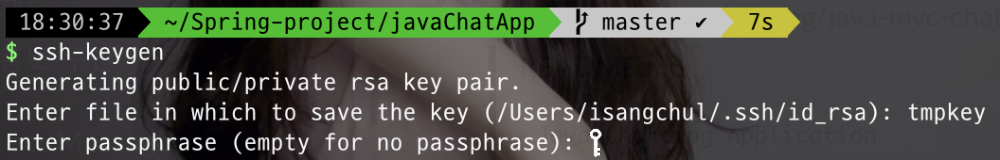

`ssh-keygen`

- 이때 Enter file... save the key 부분에서 파일명을 변경하자.(default와 다르게 하기 위해)

- 파일명.pub 키가 있는지 확인한다.(default는 ~/.ssh/파일명.pub 으로 존재한다)

 
 

# 5. Gcp-VM에 메타데이터로 ssh pub key 를 등록한다.
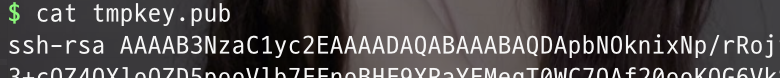

`cat tmpkey.pub` 으로 공개키를 확인하고 드래그해서 복사한다.(반드시 .pub 파일이다)

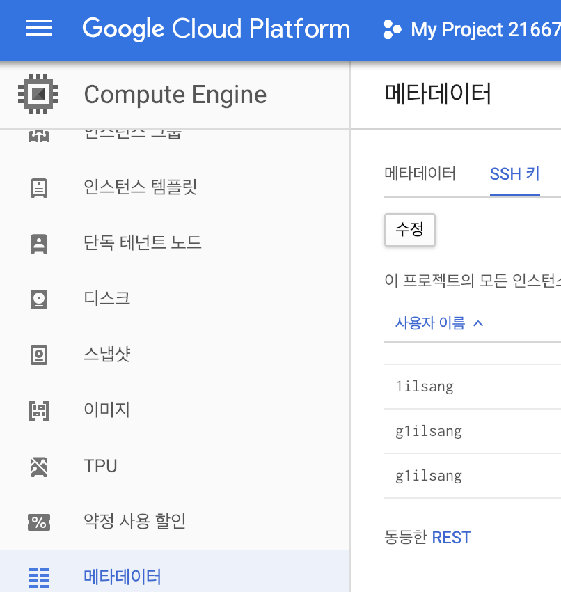

- 메타데이터에 ssh 키를 추가한다.

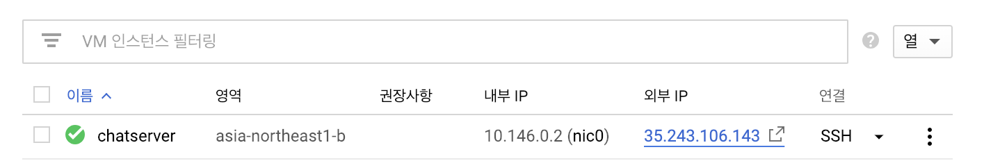

- VM 인스턴스를 실행시켜 외부 IP를 확인한다.

 
 

# 6. scp 를 통해 VM에 jar 파일을 보낸다.
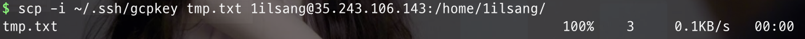

`scp -i [ssh 키의 경로] [옮길 jar 파일경로] [유저이름@ip]:[저장할경로]`

- .pub 키를 보내는게 아니다.
- 예시에선 txt 지만 jar 를 보내주어야 한다.

 
 

# 7. 채팅포트 7777과 로그인포트 6666을 열어준다.
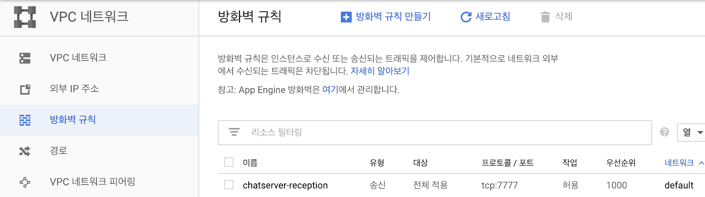

- VPC Network -> 방화벽 규칙으로 이동해 방화벽 규칙을 추가한다.

- 이때 6666, 7777 모두 송,수신 두개씩 만들어 주어야 한다(총 4개)

 
 

# 8. VM에서 ssh 접근으로 jar 파일을 실행한다.
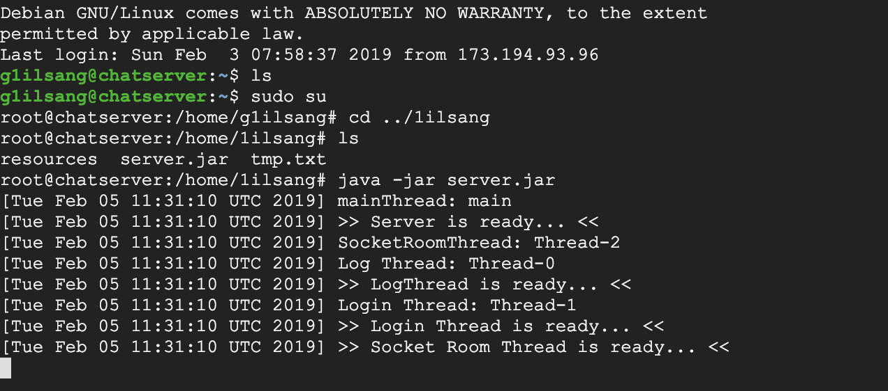

`java -jar server.jar` 명령으로 server.jar 파일을 실행한 모습.

- 만약 java 가 VM에 깔려있지 않다면 깔아주도록 한다.

 
 

# 9. Client 도 jar 파일로 만든다.

- 위의 server 와 동일하다.
- 이제 이 jar 파일을 친구들에게 뿌려서 접속시킨다.
- (윈도우 환경을 고려해 jar 를 exe 로 변환해서 배포하면 더++)
- 신나게 채팅한다!

끝.
