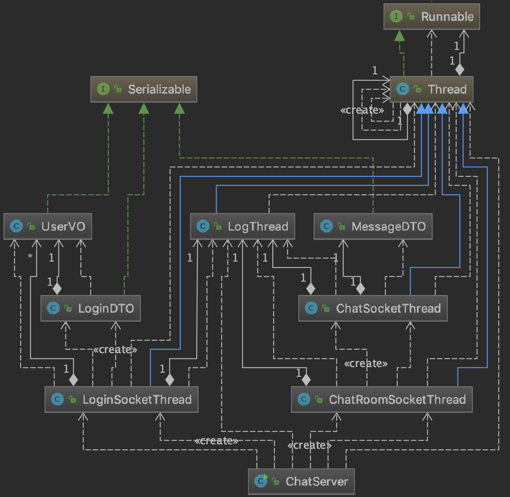

Server 클래스 분석
---


Main
---
```
public class ChatServer {
    public static void main(String[] args) {
        LogThread logThread = LogThread.getInstance();

        logThread.log("mainThread: " + Thread.currentThread().getName());
        logThread.log(">> Server is ready... <<");

        LoginSocketThread loginSocketThread = new LoginSocketThread();
        loginSocketThread.start();

        ChatRoomSocketThread chatRoomSocketThread = new ChatRoomSocketThread();
        chatRoomSocketThread.start();

    }
}
```
- 로그, 로그인, 채팅을 처리할 쓰레드들을 실행한다.

Log Thread
---
```
    @Override
    public void run() {
        logThread.log("Log Thread: " + Thread.currentThread().getName());
        logThread.log(">> LogThread is ready... <<");
        String str;
        while (flag) {
	    ...
            if (!queue.isEmpty()) {
                try {
                    str = "[" + date.getTime() + "] " + queue.peek() + "\n";
                    bw.write(str);
                    saveLogFile(str);
                    bw.flush();
                    queue.poll();
                } catch (IOException e) {
                    e.printStackTrace();
                }
            }
        }
	...
    }

    private void saveLogFile(String str) {
        try {
            bwFile.write(str);
            bwFile.flush();
        } catch (IOException e) {
            e.printStackTrace();
        }
    }
```
- `queue`에 로그 처리가 쌓이면 순차적으로 로그를 찍고 파일에 저장한다.

Login Thread
---
```
public class LoginSocketThread extends Thread {
    private static Map<String, UserVO> uMap;
    ...
    @Override
    public void run() {
        String threadName = Thread.currentThread().getName();
        logThread = LogThread.getInstance();
        uMap = new HashMap<>();

        ServerSocket serverSocket = null;
        try {
            serverSocket = new ServerSocket(Integer.parseInt(PORT));
            logThread.log("Login Thread: " + Thread.currentThread().getName());
            logThread.log(">> Login Thread is ready... <<");

            while (true) {
                Socket socket = serverSocket.accept();
                logThread.log(threadName + " :: Login Request :: " + socket.getInetAddress());
                ObjectInputStream in = new ObjectInputStream(socket.getInputStream());
                ObjectOutputStream out = new ObjectOutputStream(socket.getOutputStream());

                LoginDTO getDTO = (LoginDTO) in.readObject();
                LoginDTO sendDTO = null;

                String name = getDTO.getUserVO().getUserName();

                // Noti LoginService
                if (getDTO.getAction().equals("/signUp")) {
                    if (uMap.containsKey(name)) {
                        sendDTO = new LoginDTO(false, ACCOUNT_ALREADY_EXIST);
                    } else {
                        uMap.put(name, getDTO.getUserVO());
                        sendDTO = new LoginDTO(true, SIGN_UP);
                    }
                } else if (getDTO.getAction().equals("/signIn")) {
                    if (!uMap.containsKey(name)) {
                        sendDTO = new LoginDTO(false, LOGIN_FAIL);
                    } else if (uMap.get(name).getPw().equals(getDTO.getUserVO().getPw())) {
                        sendDTO = new LoginDTO(true, LOGIN_SUCCESS);
                    } else sendDTO = new LoginDTO(false, LOGIN_FAIL);
                }
                logThread.log(threadName + " :: Login " + sendDTO.isAccess() + " " + sendDTO.getMessage());

                out.writeObject(sendDTO);
                out.flush();
                in.close();
                out.close();
                socket.close();
            }
        } catch (Exception e) {
            e.printStackTrace();
        }
    }
}
```
- `HashMap`을 활용해 로그인을 간단하게 처리했다.(맵에 유저객체가 있다면 로그인한 상태다)
- 그러므로 서버가 다운되면 모든 로그인 정보를 잃어버린다.

Chatting Thread
---
```
public class ChatSocketThread extends Thread {
    private int SYK = 1 << 5;
    private int FIN = 1 << 2;
    ...
    public ChatSocketThread(Socket s, ArrayList[] roomList) throws IOException {
        this.socket = s;
        this.roomList = roomList;
    }

    @Override
    public void run() {
	...
        try {
            logThread.log(threadName + " :: Socket Open " + socket.getInetAddress());
            while (true) {
                sleep(100);
                messageDTO = (MessageDTO) in.readObject();
                curRoom = roomList[messageDTO.getRoomNumber()];
                curUserName = messageDTO.getName();
                curRoomNumber = messageDTO.getRoomNumber();

                if (!curRoom.contains(this)) curRoom.add(this);
                isFInFlag = manufactureMessageDTO(threadName, messageDTO);

                for (Object e : curRoom) ((ChatSocketThread) e).out.writeObject(messageDTO);
                if (isFInFlag) break;
            }
	}
	...
        } finally {
            logThread.log(threadName + " :: Socket Close - Leave - " + this.messageDTO.getName());
	...
    }

    private boolean manufactureMessageDTO(String threadName, MessageDTO messageDTO) {
        boolean isFin = false;
        if (messageDTO.getFLAG() == SYK) {
            logThread.log(threadName + " :: Room[" + messageDTO.getRoomNumber() + "] " + messageDTO.getName() + " 유저가 방에 접속");
        } else if (messageDTO.getFLAG() == FIN) {
            curRoom.remove(this);
            logThread.log(threadName + " :: Room[" + messageDTO.getRoomNumber() + "] " + messageDTO.getName() + " 유저가 방에서 떠남.");
            isFin = true;
        } else {
            logThread.log(threadName + " :: Room[" + messageDTO.getRoomNumber() + "] " + messageDTO.getContents());
        }
        return isFin;
    }
```
- `ChatRoomSocketThread`에서 파생된 클래스다. 유저가 방에 접속할때마다 이 쓰레드가 하나씩 생긴다.
- 받은 메시지를 방마다 따로 묶인 쓰레드 그룹에 `BroadCast` 해준다.
- 유저가 접속/나갈때 `SYK`, `FIN`을 따로 두어 시스템 메시지를 날려준다.
